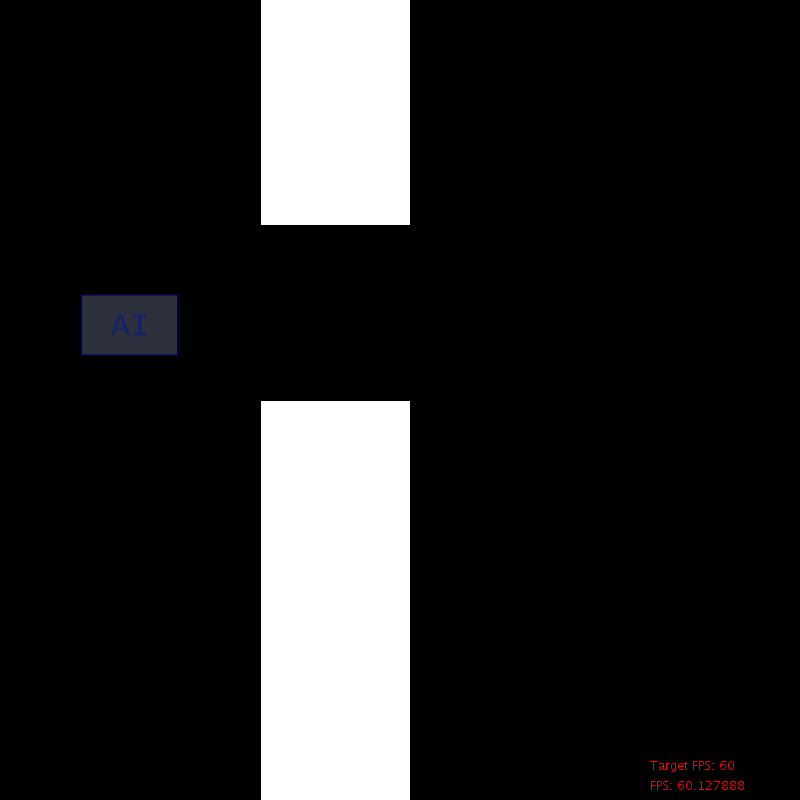

# About

PipeFlyer is an AI that learns to fly through obstacles by using Neural Networks and Genetic Algorithms.

# License

PipeFlyer is a project by [UnexomWid](http://unexomwid.github.io). It is licensed under the [General Public License (GPL) version 3](https://www.gnu.org/licenses/gpl-3.0.en.html).

# Releases

>Note: versions with the suffix **R** are considered stable releases, while those with the suffix **D** are considered unstable.

None.

# Note

This sketch was created for testing and experimenting purposes. There are better ways to accomplish what this sketch accomplishes.

# How it works

First, a population of randomly initialized Neural Networks is created. Each member of the population is called a *player*, and decides every frame if it should jump or not.
Players that perform better have a higher score, and are more likely to be present in future generations. The best player will *always* be present in the next generation.

## Gene pool

After all players die, a new population is created from the gene pool of the current population. The number of times a player appears in the pool depends on its score.

>Example: if a player has a score of 500, it will appear 500 times in the gene pool.

## Crossover & Mutation

In order to create a member for the new generation, two random parents are chosen from the gene pool: network *A* and network *B*. The weights and biases of the child will be determined by the 
arithmetic mean between network *A* and network *B*. However, there's also random mutation (based on the mutation chance). After the child is created, it is added to the new population.

## New Generation 

After the new generation has been fully populated, the new players are tested and evolved just like those from the previous generation. This process repeats until a player successfully learns to fly
properly through the obstacles. At this point, the goal has been reached.

# Network Structure

>Note: This project does *not* use NEAT (NeuroEvolution of Augmenting Topologies). In other words, all networks have a fixed structure (number of neurons and layers) that does *not* evolve.

By default, each network has 4 layers:

* Input Layer: 6 neurons
* Hidden Layer 0: 16 neurons
* Hidden Layer 1: 16 neurons
* Output Layer: 2 neurons

All weights are between *-2* and *2*, while all biases are between *-5* and *5*.

The structure of the networks can be tweaked in any way (see `createNetwork()` and `getPlayerData()`, inside `PipeFlyer.pde`). These numbers have
been chosen arbitrarily.

## Activation Function

All layers use the same activation function for simplicity, a *fast sigmoid* function: `x/(1 + abs(x))`.